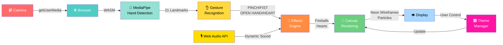
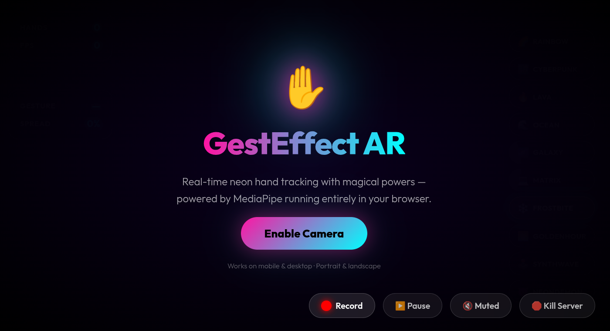

# 🖐️ GestEffect — Real-time AR Hand Tracking Web App

> A browser-based augmented reality application that tracks hands via webcam, recognises gestures, and renders live neon visual effects — powered by **MediaPipe (WASM) running entirely in your browser**.

[](https://python.org)
[](https://flask.palletsprojects.com/)
[](https://mediapipe.dev/)
[](LICENSE)
[](https://github.com/Sam-max1/gesteffect)
[](https://sam-max1-gesteffect.hf.space/)

---

## Overview

GestEffect streams your webcam feed through a **client-side ML pipeline** that:
1. Detects up to **2 hands simultaneously** using MediaPipe (WASM, GPU-optimized)
2. Extracts **21 landmarks** per hand and recognises **4 gestures** (PINCH, FIST, OPEN HAND, FINGER HEART)
3. Renders **neon glowing wireframes** and **inter-hand connections** over a darkened background
4. Spawns **interactive effects**: fireballs (charge via hand friction), floating hearts, particles with sound
5. Provides a **glassmorphism UI** with real-time stats, 10+ switchable themes, and 60-second video recording

**🚀 All inference runs in-browser via WASM** — zero backend ML load, instant response, full privacy.

### Application Flow



**Key Advantage**: No backend inference needed — all processing happens client-side for privacy & speed!

---

## 🚀 Try It Live!

**GestEffect is live and ready to use!** ✨

### 🌐 Live Demo (Hosted on Hugging Face Spaces)

**👉 [Visit GestEffect on Hugging Face Spaces](https://sam-max1-gesteffect.hf.space/)**

No installation required — just click and start! The app runs entirely in your browser with all hand tracking processed locally via MediaPipe WASM.

#### Live Demo Screenshot



**What you get instantly:**
- ✅ Real-time hand tracking (no setup, no data collection)
- ✅ 10 neon themes (auto-rotating or manual selection)
- ✅ Fireball & heart effects (interactive magic!)
- ✅ Video recording (up to 60 seconds, MP4 export)
- ✅ Full glassmorphism UI (responsive mobile + desktop)
- ✅ Works on mobile & desktop browsers

> 💡 **Privacy First**: Camera access is local-only. No video data leaves your device. All processing happens in your browser.

---
- ✅ 10 neon themes (auto-rotating or manual)
- ✅ Fireball & heart effects
- ✅ Video recording (60 seconds)
- ✅ Full glassmorphism UI
- ✅ Works on mobile & desktop

> 💡 **Tip**: Allow camera access when prompted. The app runs entirely in your browser — no data is sent to servers.

---

| Feature | Details |
|---------|---------|
| 🖐️ Hand Tracking | Up to 2 hands, 21 landmarks each via MediaPipe WASM (GPU-accelerated) |
| 👌 Gesture Recognition | PINCH, FIST, OPEN HAND, & FINGER HEART (💕) with real-time detection |
| 📊 Hand Spread Metric | 0–100% spread from palm centre to fingertips (live display) |
| 🌈 10+ Neon Themes | Rainbow, Cyberpunk, Lava, Ocean, Galaxy, Matrix, Frostbite, GoldenHour, Synthwave, NeonDemon with auto-rotation |
| ✨ Multiverse Connections | Lines between matching fingertips of both hands in real-time |
| 🔥 Fireball Effects | Charge via hand friction, auto-throw when fully grown, particle trails, sound effects |
| 💕 Heart Spawner | Finger heart gesture spawns floating pink hearts with particle burst on expiry |
| 📡 Neon Wireframe | Full hand skeleton with glow effects, sparkles, and mirrored rendering |
| 🎙️ Dynamic Audio Engine | Background oscillation synced to hand spread, fireball & heart SFX with Web Audio API |
| 🎥 Video Recording | Record up to 60 seconds with MP4 export, countdown timer, auto-save with timestamp |
| ⏯️ Playback Controls | Pause/resume, mute audio, kill server, live FPS counter |
| 🎛️ Live Stats UI | Real-time display: FPS, hand count, gesture type, hand spread percentage |
| 📱 Responsive Design | Mobile & desktop optimized, portrait & landscape, glassmorphism UI |
| 🌑 Darkened Canvas | Video feed darkened with transparency for neon effect enhancement |
| 🔐 Camera Management | Graceful permission request, track release on app termination |
| 🎨 Real-time Theme Switching | 10 switchable themes with live updates (no reload needed) |
| ⚡ Client-Side Processing | All inference runs in browser via MediaPipe (WASM) — zero backend ML load |
| 🛡️ SSL/HTTPS Support | Runs with adhoc SSL for secure camera access on HTTPS |
| 🎪 Particle System | Explosive particle effects on heart expiry, trail effects on fireballs |
| 📊 Performance Optimized | 25–30 FPS on CPU, higher with GPU, ~100–150ms end-to-end latency |

---

## Tech Stack

| Layer | Technology |
|-------|-----------|
| **Backend** | Python 3.8+, Flask 3.0 (minimal — only theme persistence) |
| **Computer Vision** | MediaPipe Hand Landmarker 0.10 (WASM, GPU-optimized) |
| **Canvas Rendering** | HTML5 Canvas 2D Context with WebGL fallback |
| **Audio** | Web Audio API for dynamic sound generation |
| **Streaming** | Zero network — all processing in-browser (client-side) |
| **Frontend** | HTML5, CSS3 (glassmorphism), Vanilla JavaScript (ES6+) |
| **Security** | HTTPS with adhoc SSL, no external data transmission |

---

## Requirements

- **Python** 3.8 or higher (for Flask backend only)
- **A webcam** (USB or integrated) — any camera compatible with your OS
- **A modern browser** with HTTPS support (Chrome, Firefox, Safari, Edge) — see [Browser Compatibility](#browser-compatibility)
- **HTTPS context** — required for camera permission on secure origins
- **~200MB disk space** for Python dependencies (Flask, Werkzeug, pyOpenSSL)
- **~150–250MB RAM** for browser runtime (MediaPipe WASM + rendering)

**GPU is optional** but strongly recommended:
- **Without GPU**: 15–30 FPS (CPU inference on MediaPipe WASM)
- **With GPU** (WebGL acceleration): 30–60 FPS (significant speedup)

**Tested Platforms**:
- ✅ Linux (Ubuntu, Debian, Fedora)
- ✅ macOS (Intel & Apple Silicon)
- ✅ Windows 10/11
- ✅ Mobile (Android Chrome, partial iOS support)

---

## Installation

```bash
# 1. Clone the repository
git clone https://github.com/Sam-max1/gesteffect.git
cd gesteffect

# 2. (Optional) Create a virtual environment
python -m venv venv
source venv/bin/activate      # Linux/macOS
# venv\Scripts\activate       # Windows

# 3. Install dependencies
pip install -r requirements.txt

# 4. Run the Flask server
python app.py
```

You should see:
```
  ____           _   _____  __  __          _   
 / ___| ___  ___| |_| ____|/ _|/ _| ___  ___| |_ 
| |  _ / _ \/ __| __|  _| | |_| |_ / _ \/ __| __|
| |_| |  __/\__ \ |_| |___|  _|  _|  __/ (__| |_ 
 \____|\___||___/\__|_____|_| |_|  \___|\___|\__|

GestEffect AR — Client-Side MediaPipe Engine
============================================
UI Address: https://<your-local-ip>:5000
Local URL : https://127.0.0.1:5000
============================================
```

Open your browser at: **https://localhost:5000** (or the address shown above)

> ⚠️ **HTTPS Required**: Camera access requires a secure context. The app runs with adhoc SSL by default.

---

## Gestures & Magic Mechanics

### Hand Gestures

| Gesture | Trigger | Visual Feedback |
|---------|---------|---|
| **PINCH!** 🤏 | Thumb tip → Index tip distance < 6% of frame width | Pink indicator + sound effect |
| **Fist** ✊ | All fingertip distances from palm < 12% | Orange indicator + bass tone |
| **Open Hand** 🖐 | Default (neither pinch nor fist) | Cyan indicator |
| **Finger Heart** 💕 | Thumb + index close & pointing upward, other fingers curled | Heart wireframe charge + particle burst on spawn |

### Special Effects

| Power | Activation | Effect | Audio |
|-------|-------|---|---|
| **Fireball** 🔥 | Rub two hands together (hand friction) | Glowing sphere charges, auto-throws at max size, trails behind | Sawtooth sweep on throw |
| **Single Fireball** 🔥 | Throw single hand with velocity | Creates fireball projectile instantly | Fireball SFX |
| **Floating Hearts** 💕 | Hold finger heart gesture | Spawns floating pink hearts every few frames, physics-based | Heart pop SFX |

---

## Themes

Click any button in the bottom-right theme bar to switch instantly:

| Button | Theme | Colour Palette |
|--------|-------|---|
| 🌈 | Rainbow | Cycles Blue → Green → Red (dynamic) |
| 🌃 | Cyberpunk | Neon Pink (#ff14a3) + Cyan (#00ffff) — **DEFAULT** |
| 🔥 | Lava | Red + Orange + Yellow (fiery) |
| 🌊 | Ocean | Teal (#00e5ff) + Deep Blue (#0088ff) |
| 🌌 | Galaxy | Purple + Magenta + White (cosmic) |
| 💻 | Matrix | Green (#00ff00) + Dark Green (#00bb00) |
| ❄️ | Frostbite | White + Light Blue + Sky Blue (icy) |
| 🌅 | GoldenHour | Orange + Yellow + Pink (sunset) |
| 🕹️ | Synthwave | Magenta + Cyan + Pink (retro-80s) |
| 😈 | NeonDemon | Deep Red + Crimson + Light Red (demonic) |

**Theme Auto-Rotation**: Themes cycle every 15 seconds if not manually selected. Click any theme button to disable auto-rotation and lock your choice. All updates render **live** — no page reload needed.

---

## Project Structure

```
gesteffect/
├── app.py                              # Flask backend (minimal — only theme persistence)
├── requirements.txt                    # Python dependencies
├── templates/
│   └── index.html                      # Web UI with camera overlay & stats panels
├── static/
│   ├── main.js                         # Main engine: MediaPipe, gestures, effects, recording
│   └── style.css                       # Glassmorphism styling, responsive layout, animations
├── .github/
│   └── workflows/
│       ├── python-check.yml            # GitHub Actions: Python syntax validation
│       └── documentation-check.yml     # GitHub Actions: Markdown linting
├── docs/                               # Additional documentation
├── GESTEFFECT_DESIGN_ARCHITECTURE.md   # Full technical deep-dive
├── CONTRIBUTING.md                     # Contribution guidelines
├── CODE_OF_CONDUCT.md                  # Community standards
├── SECURITY.md                         # Security policy & notes
├── LICENSE                             # MIT License
├── .gitignore                          # Python + IDE exclusions
└── README.md                           # This file
```

---

## API Endpoints

| Endpoint | Method | Description |
|----------|--------|-------------|
| `/` | GET | Serves `index.html` with embedded MediaPipe WASM engine |
| `/get_theme` | GET | Returns current active theme + array of available themes |
| `/update_theme` | POST | Persist a theme selection from the client (thread-safe) |
| `/kill` | POST | Gracefully terminates client session and stops camera stream |

### Example: Get Available Themes

```bash
curl -k https://localhost:5000/get_theme
```
```json
{
  "theme": "Cyberpunk",
  "available_themes": ["Rainbow", "Cyberpunk", "Lava", "Ocean", "Galaxy", "Matrix", "Frostbite", "GoldenHour", "Synthwave", "NeonDemon"]
}
```

### Example: Switch Theme

```bash
curl -k -X POST https://localhost:5000/update_theme \
  -H "Content-Type: application/json" \
  -d '{"theme": "Matrix"}'
```
```json
{"status": "success", "theme": "Matrix"}
```

### Example: Kill Server

```bash
curl -k -X POST https://localhost:5000/kill
```
```json
{"status": "success", "message": "Client session terminated. Server remains running."}
```

---

## Configuration

Edit `static/main.js` to tune the following constants:

```javascript
// Gesture detection thresholds (frame-width normalized)
const PINCH_THRESHOLD = 0.06;   // 6% of frame width for thumb-index distance
const FIST_THRESHOLD  = 0.12;   // 12% of frame width for max palm-to-fingertip distance

// Camera settings (in getUserMedia call)
video: {
    facingMode: "user",
    width: { ideal: 1280 },
    height: { ideal: 720 }
}

// MediaPipe confidence thresholds
minHandDetectionConfidence: 0.5
minHandPresenceConfidence: 0.5
minTrackingConfidence: 0.5
numHands: 2     // max 2 hands tracked

// Audio config
audioEngine.master.gain.value = 0;  // Start muted
audioEngine.master.gain.setTargetAtTime(value, time, 0.1);  // Smooth ramp
```

Edit `app.py` to change Flask settings:

```python
# SSL context - "adhoc" uses self-signed certificates
app.run(debug=False, threaded=True, host='0.0.0.0', port=5000, ssl_context='adhoc')

# Available themes (can be extended)
VALID_THEMES = [
    "Rainbow", "Cyberpunk", "Lava", "Ocean", "Galaxy",
    "Matrix", "Frostbite", "GoldenHour", "Synthwave", "NeonDemon"
]
```

---

## Performance

| Metric | Typical Value |
|--------|--------------|
| **Target FPS** | 30 |
| **Achieved FPS** | 25–30 (CPU), 30–60 (GPU with acceleration) |
| **End-to-end Latency** | ~100–150ms (perception to render) |
| **Resolution** | 1280×720 (default, adjustable) |
| **CPU Usage** | 15–40% (single-threaded JS, varies by hardware) |
| **Browser Memory** | ~150–250MB (MediaPipe WASM + runtime) |
| **Startup Time** | ~3–5 seconds (MediaPipe model download + initialization) |
| **Recording Overhead** | +5–10% CPU during MP4 capture |

### Optimising Performance

- **Enable GPU**: Ensure `delegate: "GPU"` in MediaPipe config (requires WASM WebGL support)
- **Reduce Resolution**: Lower canvas size or camera feed resolution in `getUserMedia` config
- **Fewer Hands**: Set `numHands: 1` if tracking single hand only
- **Lower Confidence**: Decrease `minHandDetectionConfidence` to reduce computation (trade-off: accuracy)
- **Browser Choice**: Chrome & Edge perform best; Firefox is also good; Safari may be slower
- **Close Background Apps**: Frees system resources for smooth rendering
- **Check Hardware**: Modern CPUs/GPUs handle 1280×720 @ 30fps easily; older devices may need resolution tuning

---

## Colour Palette Reference

All colours are in **HEX format** (standard web colours). Core glow colour is applied to the inner wireframe line:

| Theme | Primary Colour | Secondary Colour | Tertiary Colour | Core Glow |
|-------|---|---|---|---|
| **Rainbow** | #ff0000 (Red) | #00ff00 (Green) | #0000ff (Blue) | #ffffff (White) |
| **Cyberpunk** | #ff14a3 (Neon Pink) | #00ffff (Cyan) | — | #ffffff (White) |
| **Lava** | #ff2200 (Red-Orange) | #ff8800 (Orange) | #ffff00 (Yellow) | #ffffff (White) |
| **Ocean** | #00e5ff (Aqua) | #0088ff (Sky Blue) | — | #ffffff (White) |
| **Galaxy** | #cc00ff (Purple) | #ff00ff (Magenta) | #ffffff (White) | #ffffff (White) |
| **Matrix** | #00ff00 (Neon Green) | #00bb00 (Dark Green) | — | #ccffcc (Light Green) |
| **Frostbite** | #ffffff (White) | #aaddff (Light Blue) | #4499ff (Sky Blue) | #ffffff (White) |
| **GoldenHour** | #ff9900 (Orange) | #ffdd00 (Golden Yellow) | #ff6688 (Pink) | #fff0cc (Pale Yellow) |
| **Synthwave** | #ff00ff (Magenta) | #00ffff (Cyan) | #ff0077 (Hot Pink) | #ffccff (Light Magenta) |
| **NeonDemon** | #ff0000 (Red) | #cc0000 (Dark Red) | #ff4444 (Light Red) | #ff9999 (Pale Red) |

---

## Troubleshooting

| Symptom | Solution |
|---------|---------|
| **Camera permission denied** | Browser needs HTTPS (not HTTP). Use `https://localhost:5000` and accept the certificate warning. Camera is required for MediaPipe detection. |
| **No hands detected** | Check lighting — avoid backlit environments. Lower `minHandDetectionConfidence` in `main.js` from 0.5 to 0.3. Try a different angle. |
| **Low FPS / laggy rendering** | Close background apps; disable browser extensions. Try Chrome (best performance). GPU-accelerated MediaPipe requires `delegate: "GPU"` support. |
| **Theme not changing** | Verify theme name matches `VALID_THEMES` list in `app.py`. Refresh the page if stuck. |
| **Fireballs not appearing** | Ensure two hands are detected and close together. Try rubbing your hands in front of the camera. |
| **Hearts not spawning** | Hold the finger heart pose (thumb + index close & pointing up). May need 1–2 seconds to charge. |
| **Audio not working** | Browser may block audio until user interacts with the page. Click the mute button to unmute. Some browsers auto-mute by default. |
| **Recording button not working** | Video recording requires the page to be focused. Ensure no other tabs are stealing focus. |
| **Video export fails** | Some browsers don't support MP4 encoding. File saves as `.mp4` but may be WebM internally. Try a different browser. |
| **High CPU usage** | Reduce canvas resolution in `index.html` or lower `minHandDetectionConfidence` for faster inference. GPU acceleration helps significantly. |
| **Connection refused** | Server may have crashed. Check terminal for errors; restart with `python app.py`. |
| **Certificate warning on Chrome** | Normal for self-signed SSL. Click "Advanced" → "Proceed to localhost" to continue. |

---

## Extending GestEffect

### Add a Custom Gesture

In `static/main.js`, extend the `detectGesture()` function:

```javascript
function detectGesture(lm) {
    const dist = (a, b) => Math.hypot(a.x - b.x, a.y - b.y);
    
    // Existing gestures...
    if (dist(lm[4], lm[8]) < PINCH_THRESHOLD) return 'PINCH! 🤏';
    
    // Your custom gesture: e.g., Peace sign (index + middle up, others down)
    if (lm[8].y < lm[9].y && lm[12].y < lm[9].y && lm[16].y > lm[9].y) {
        return 'Peace ✌️';
    }
    
    return 'Open Hand 🖐';
}
```

Then handle it in the main loop:

```javascript
let actionText = fbData.actionText || detectGesture(mirroredHands[0]);
if (actionText === 'Peace ✌️') {
    spawnParticles(canvas.width / 2, canvas.height / 2, 50, () => '#00ff00');
    audio.play('heart'); // or custom sound
}
```

### Add a Custom Theme

In `static/main.js`, add to the `THEMES` object:

```javascript
const THEMES = {
    // Existing themes...
    CyberpunkPlus: {
        colors: ['#ff00ff', '#00ffff', '#ffff00'],  // Magenta, Cyan, Yellow
        core: '#ffffff'
    }
};
```

Then add a button in `templates/index.html`:

```html
<button class="theme-btn" data-theme="CyberpunkPlus">
    <span class="theme-icon">⚡</span>
    <span class="theme-name">Cyberpunk+</span>
</button>
```

### Add a Custom Effect

Create a new effect class in `static/main.js` (similar to `Fireball` or `Heart`):

```javascript
class CustomEffect {
    constructor(x, y) {
        this.x = x;
        this.y = y;
        this.life = 2.0; // 2 seconds
    }
    
    update() {
        this.life -= 0.016;
    }
    
    draw(ctx) {
        ctx.globalAlpha = this.life / 2.0;
        ctx.fillStyle = '#00ff00';
        ctx.beginPath();
        ctx.arc(this.x, this.y, 30, 0, Math.PI * 2);
        ctx.fill();
    }
}
```

Trigger it in the gesture detection logic:

```javascript
if (actionText === 'YourGesture') {
    customEffects.push(new CustomEffect(x, y));
}
```

### Enable Server-Side Backend Processing

Replace Flask's minimal theme-only approach with full OpenCV processing by modifying `app.py`:

```python
# Example: Add a new endpoint for custom metrics
@app.route('/analyze', methods=['POST'])
def analyze():
    data = request.get_json()
    landmarks = data.get('landmarks')
    # Your analysis here
    return jsonify({'result': ...})
```

Then call from JavaScript:

```javascript
fetch('/analyze', {
    method: 'POST',
    headers: {'Content-Type': 'application/json'},
    body: JSON.stringify({landmarks: lm})
}).then(r => r.json()).then(data => console.log(data));
```

---

## Security Notes

- **HTTPS Enforced**: App runs with self-signed SSL certificate (`ssl_context='adhoc'`) — required for camera access
- **No Video Storage**: Video feed is never transmitted externally or saved to disk (unless manually recorded by user)
- **Client-Side Processing**: All MediaPipe inference runs in-browser via WASM — no ML models sent to server
- **Theme Persistence Only**: Backend only stores/transmits current theme selection (protected by threading locks)
- **Camera Permissions**: User must explicitly grant camera access. Can be revoked in browser settings anytime
- **Recording is Local**: Video recordings are generated on-device and downloaded directly — not uploaded anywhere
- **Network Isolation**: For strict local-only access, change Flask host from `'0.0.0.0'` to `'127.0.0.1'`
- **No Credentials Stored**: No authentication required; suitable for local/LAN use only
- **Graceful Shutdown**: `/kill` endpoint stops the client session safely; server continues running for reconnection

---

## Browser Compatibility

| Browser | Canvas 2D | MediaPipe WASM | Web Audio | Camera API | Notes |
|---------|-----------|---|---|---|---|
| **Chrome / Chromium** | ✅ Excellent | ✅ Full GPU | ✅ Full | ✅ Full | **Recommended** — Best performance & WASM optimization |
| **Firefox** | ✅ Excellent | ✅ Good | ✅ Full | ✅ Full | Solid performance, reliable WASM support |
| **Safari** | ✅ Good | ⚠️ Limited | ✅ Full | ✅ Full | Works well; WASM slower; requires HTTPS |
| **Edge** | ✅ Excellent | ✅ Full GPU | ✅ Full | ✅ Full | Chromium-based; performance matches Chrome |
| **Opera** | ✅ Good | ✅ Good | ✅ Full | ✅ Full | Chromium-based; works well |
| **Mobile Chrome** | ✅ Good | ⚠️ Limited WASM | ✅ Limited | ✅ Full | Portrait mode works; performance varies by device |
| **Mobile Safari (iOS)** | ✅ Fair | ❌ No WASM | ✅ Limited | ⚠️ Limited | iOS restricts camera & WASM; experimental support |
| **Samsung Internet** | ✅ Good | ✅ Good | ✅ Full | ✅ Full | Mobile Chromium fork; good compatibility |

**Requirements**:
- ✅ Canvas 2D Context support (universal)
- ✅ WebGL for WASM acceleration (highly recommended)
- ✅ Web Audio API for sound effects
- ✅ MediaStream / `getUserMedia` for camera access
- ✅ HTTPS (required for camera permissions)

**Best Experience**: Chrome/Chromium on desktop with GPU acceleration.

---

## Contributing

See [CONTRIBUTING.md](CONTRIBUTING.md) for guidelines and [CODE_OF_CONDUCT.md](CODE_OF_CONDUCT.md) for community standards.

---

## License

MIT License — see [LICENSE](LICENSE) for details.

---

## Acknowledgements

- [MediaPipe](https://mediapipe.dev/) by Google — hand landmark detection
- [OpenCV](https://opencv.org/) — computer vision and video processing
- [Flask](https://flask.palletsprojects.com/) — lightweight Python web framework
- Glassmorphism design pattern for the frosted-glass UI aesthetic

---

**Version**: 1.0 | **Status**: Production Ready ✨ | **Last Updated**: May 2026

---

## 🌟 Support & Star This Repo!

If you found this project helpful and inspiring, **please consider giving it a star**! ⭐️ 

A star helps the project grow and reach more developers like you. It takes just a second and means a lot to the community:

[](https://github.com/imaxx2/gesteffect/stargazers)

**Thank you for supporting open-source development!** 🙏
