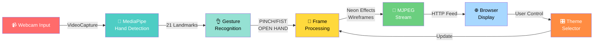

# 🖐️ GestEffect — Real-time AR Hand Tracking Web App

> A browser-based augmented reality application that tracks hands via webcam, recognises gestures, and renders live neon visual effects — powered by Python, Flask, MediaPipe, and OpenCV.

[](https://python.org)
[](https://flask.palletsprojects.com/)
[](https://mediapipe.dev/)
[](https://opencv.org/)
[](LICENSE)
[](https://github.com/imaxx2/gesteffect)
[](https://github.com/imaxx2/gesteffect)

---

## Overview

GestEffect streams your webcam feed through a Python processing pipeline that:
1. Detects up to **2 hands simultaneously** using MediaPipe
2. Extracts **21 landmarks** per hand and recognises **3 gestures** (PINCH, FIST, OPEN HAND)
3. Renders **neon glowing wireframes** and **inter-hand connections** over a darkened background
4. Streams the annotated frames to your browser as a live **MJPEG video feed**
5. Provides a **glassmorphism UI** with real-time stats and 5 switchable colour themes

### Application Flow



---

## Features

| Feature | Details |
|---------|---------|
| 🖐️ Hand Tracking | Up to 2 hands, 21 landmarks each via MediaPipe |
| 👌 Gesture Recognition | PINCH, FIST, OPEN HAND with pixel-distance thresholds |
| 📊 Hand Spread Metric | 0–100% spread from palm centre to fingertips |
| 🌈 5 Neon Themes | Rainbow, Cyberpunk, Lava, Ocean, Galaxy |
| ✨ Multiverse Connections | Lines between matching fingertips of both hands |
| 📡 MJPEG Streaming | Low-latency browser video without WebRTC |
| 🎛️ Live Stats UI | FPS, hand count, gesture, spread — polled every 100ms |
| 📱 Responsive Design | Glassmorphism panels scale to mobile and tablet |

---

## Tech Stack

| Layer | Technology |
|-------|-----------|
| Backend | Python 3.8+, Flask 3.0, OpenCV 4.8 |
| Computer Vision | MediaPipe 0.10 (hand landmark detection) |
| Streaming | MJPEG multipart/x-mixed-replace |
| Frontend | HTML5, Vanilla CSS3 (glassmorphism), Vanilla JavaScript |

---

## Requirements

- Python **3.8** or higher
- A **webcam** (USB or integrated) — `/dev/video0` on Linux, default device on Windows/macOS
- A modern browser (Chrome, Firefox, Safari, Edge)
- ~500MB disk space for Python dependencies

GPU is **optional** — MediaPipe runs on CPU, but GPU significantly improves FPS.

---

## Installation

```bash
# 1. Clone the repository
git clone https://github.com/imaxx2/gesteffect.git
cd gesteffect

# 2. (Optional) Create a virtual environment
python -m venv venv
source venv/bin/activate      # Linux/macOS
# venv\Scripts\activate       # Windows

# 3. Install dependencies
pip install -r requirements.txt
```

---

## Quick Start

```bash
python app.py
```

You should see:
```
Starting GestEffect application...
Available themes: ['Rainbow', 'Cyberpunk', 'Lava', 'Ocean', 'Galaxy']
 * Running on http://0.0.0.0:5000
```

Open your browser at: **http://localhost:5000**

---

## Gestures

| Gesture | Trigger | UI Colour |
|---------|---------|-----------|
| **PINCH!** | Thumb tip → Index tip distance < 50px | 🩷 Pink |
| **Fist** | All fingertip distances from palm < 80px | 🟠 Orange |
| **Open Hand** | Default (neither pinch nor fist) | 🩵 Cyan |

---

## Themes

Click any button in the bottom-centre theme bar:

| Button | Theme | Colours |
|--------|-------|---------|
| 🌈 | Rainbow | Cycles Blue → Green → Red |
| 🌃 | Cyberpunk | Neon Pink + Cyan (default) |
| 🔥 | Lava | Red + Orange + Yellow |
| 🌊 | Ocean | Teal + Light Blue |
| 🌌 | Galaxy | Deep Purple + Magenta + White |

Themes update live on the next processed frame — no page reload needed.

---

## Project Structure

```
gesteffect/
├── app.py                              # Flask backend & frame processing pipeline
├── requirements.txt                    # Python dependencies
├── templates/
│   └── index.html                      # Browser UI (Jinja2 template)
├── static/
│   └── style.css                       # Glassmorphism styling & responsive layout
├── .github/
│   └── workflows/
│       ├── python-check.yml            # Python syntax CI check
│       └── documentation-check.yml    # Documentation CI check
├── GESTEFFECT_DESIGN_ARCHITECTURE.md  # Full architecture & code audit
├── CONTRIBUTING.md                     # Contribution guidelines
├── CODE_OF_CONDUCT.md                  # Community standards
├── SECURITY.md                         # Security policy
├── LICENSE                             # MIT License
└── README.md                           # This file
```

---

## API Endpoints

| Endpoint | Method | Description |
|----------|--------|-------------|
| `/` | GET | Serves `index.html` |
| `/video_feed` | GET | MJPEG stream (`multipart/x-mixed-replace`) |
| `/get_theme` | GET | Returns current theme + available themes |
| `/update_theme` | POST | Switches active theme (thread-safe) |
| `/get_stats` | GET | Returns FPS, hand count, gestures, spreads |

### Example: Get Stats

```bash
curl http://localhost:5000/get_stats
```
```json
{
  "fps": 28,
  "hand_count": 2,
  "gestures": ["PINCH!", "Open Hand"],
  "spreads": [45.5, 78.3]
}
```

### Example: Switch Theme

```bash
curl -X POST http://localhost:5000/update_theme \
  -H "Content-Type: application/json" \
  -d '{"theme": "Lava"}'
```
```json
{"status": "success", "theme": "Lava"}
```

---

## Configuration

Edit `app.py` to tune the following constants:

```python
# Gesture detection thresholds (pixel distances)
PINCH_THRESHOLD = 50   # thumb-index distance for PINCH recognition
FIST_THRESHOLD  = 80   # max palm-to-fingertip distance for FIST recognition

# Camera settings (in generate_frames())
cap.set(cv2.CAP_PROP_FRAME_WIDTH,  1280)
cap.set(cv2.CAP_PROP_FRAME_HEIGHT, 720)
cap.set(cv2.CAP_PROP_FPS,          30)

# MediaPipe confidence thresholds
min_detection_confidence = 0.5
min_tracking_confidence  = 0.5
max_num_hands            = 2
```

---

## Performance

| Metric | Typical Value |
|--------|--------------|
| Target FPS | 30 |
| Achieved FPS | 25–30 (CPU), higher with GPU |
| End-to-end latency | ~100–150ms |
| Resolution | 1280×720 |
| CPU usage | 15–40% (varies by hardware) |

### Optimising Performance

- **Reduce resolution**: `cap.set(cv2.CAP_PROP_FRAME_WIDTH, 640)` for faster processing
- **Lower FPS target**: `cap.set(cv2.CAP_PROP_FPS, 20)` to reduce CPU load
- **GPU acceleration**: Install `mediapipe-gpu` if you have CUDA support
- **Single hand mode**: Set `max_num_hands=1` to halve landmark computation

---

## Colour Palette Reference

All values in **BGR format** (OpenCV standard — note: reversed from RGB):

| Theme | Color 1 (BGR) | Color 2 (BGR) | Color 3 (BGR) |
|-------|---------------|---------------|---------------|
| Rainbow | (255,0,0) Blue | (0,255,0) Green | (0,0,255) Red |
| Cyberpunk | (147,20,255) Pink | (255,255,0) Cyan | — |
| Lava | (0,0,255) Red | (0,165,255) Orange | (0,255,255) Yellow |
| Ocean | (200,255,0) Teal | (255,200,0) Light Blue | — |
| Galaxy | (255,0,150) Purple | (255,0,255) Magenta | (255,255,255) White |

---

## Troubleshooting

| Symptom | Solution |
|---------|---------|
| **No hands detected** | Improve lighting; avoid backlit environments; try lowering `min_detection_confidence` |
| **Laggy video stream** | Reduce resolution to 640×480; close background apps; lower FPS target |
| **Theme not changing** | Open browser console (F12) for errors; verify Flask is running |
| **High CPU usage** | Reduce resolution; enable GPU; lower FPS |
| **Webcam not found** | Check `/dev/video0` permissions; try `cv2.VideoCapture(1)` if multiple cameras |
| **MJPEG stream choppy** | Try Chrome (best MJPEG support); reduce JPEG quality in `imencode` call |

---

## Extending GestEffect

### Add a Custom Gesture

In `app.py`, add logic to `FrameProcessor.detect_gesture()`:

```python
# Example: Peace/Victory gesture (index + middle up, others down)
def detect_gesture(self, landmarks, frame_width, frame_height):
    ...
    # Your landmark-based condition here
    return "Peace ✌️"
```

### Add a Custom Theme

Add an entry to `THEME_COLORS` in `app.py`, and a button in `templates/index.html`:

```python
"Neon Green": {
    "primary": [(0, 255, 0), (0, 200, 50)],   # BGR
    "secondary": (0, 80, 0),
    "glow_core": (255, 255, 255)
}
```

### Enable Video Recording

In `generate_frames()`, after `processed_frame = processor.process_frame(frame)`:

```python
out = cv2.VideoWriter('output.mp4', cv2.VideoWriter_fourcc(*'mp4v'), 30, (1280, 720))
out.write(processed_frame)
# Call out.release() in the finally block
```

---

## Security Notes

- Flask runs on `0.0.0.0:5000` — accessible on your local network by default
- No video data is transmitted externally or stored to disk
- Theme updates are protected by `threading.Lock()` to prevent race conditions
- For local-only access, change `host='0.0.0.0'` to `host='127.0.0.1'` in `app.py`

---

## Browser Compatibility

| Browser | MJPEG Support | Notes |
|---------|--------------|-------|
| Chrome / Chromium | ✅ Full | Recommended |
| Firefox | ✅ Full | Good performance |
| Safari | ✅ Full | Works well |
| Edge | ✅ Full | Good performance |
| Mobile Browsers | ⚠️ Limited | UI is responsive; stream performance varies |

---

## Contributing

See [CONTRIBUTING.md](CONTRIBUTING.md) for guidelines and [CODE_OF_CONDUCT.md](CODE_OF_CONDUCT.md) for community standards.

---

## License

MIT License — see [LICENSE](LICENSE) for details.

---

## Acknowledgements

- [MediaPipe](https://mediapipe.dev/) by Google — hand landmark detection
- [OpenCV](https://opencv.org/) — computer vision and video processing
- [Flask](https://flask.palletsprojects.com/) — lightweight Python web framework
- Glassmorphism design pattern for the frosted-glass UI aesthetic

---

**Version**: 1.0 | **Status**: Production Ready ✨ | **Last Updated**: May 2026

---

## 🌟 Support & Star This Repo!

If you found this project helpful and inspiring, **please consider giving it a star**! ⭐️ 

A star helps the project grow and reach more developers like you. It takes just a second and means a lot to the community:

[](https://github.com/imaxx2/gesteffect/stargazers)

**Thank you for supporting open-source development!** 🙏
